```{r setup, include=FALSE}
options(htmltools.dir.version = FALSE)
knitr::opts_chunk$set(messagwese=FALSE, warning = FALSE)
xaringanthemer::style_mono_accent(base_color ="#23395b", 
                                  title_slide_text_color="#23395b", 
                                  title_slide_background_color = "#fbf9f4", 
                                  background_color = "#fbf9f4", 
                                  link_color =  "#F21A00", 
                                  code_font_size = "60%")

options(htmltools.dir.version = FALSE)
knitr::opts_chunk$set(message=FALSE, warning = FALSE, error=TRUE, cache=TRUE)
``` 

class:middle 

## Outline

- **The Effect of Streaming Chats on Perceptions of Debates.** Journal of Communication, 2021. Joint work with  Kevin Munger, Katherine McCabe, Victory Asbury and Keng-Chi* .footnote[ Thanks to Russell Sage Foundation and the Summer Institute in Computational Social Science for providing funding and institutional support to the projects ] 

- Future work: **Contextual cues and majority illusion on social media**


---
class:middle, center, inverse

## Streaming Chats and Politics

---

## Recent Changes on Media Market. 

--

- New media technologies <~~> Media Consumption and Broadcasting becoming more social.  

--

- Users move from passive consumers to an active co-creators of the media experience. 

--

- On the user side: emergence of social media app brings the user to the center of media production. 

--

- On the supply side: Media producers started to integrate their products with a strong audience participation. 

    - Dual Screening: Encouraging audiences to engage with their content via social media.

--

---
class: center, middle

### **Streaming Chats** are the most recent and powerful manifestation of these user-centered technologies.

---
## Streaming Chats

--

**Video Feed + Social Chat: All in one screen.**

--

Already widely adopted by mainstream media broadcasting: news TV shows, sports programs, and political debates.

--

Popular among the younger generations.

- Twitch (Amazon)
- YouTube/YouTube Gaming (Google)
- Mixer (Microsoft)
- Facebook Lives

--

---
## Political Debates

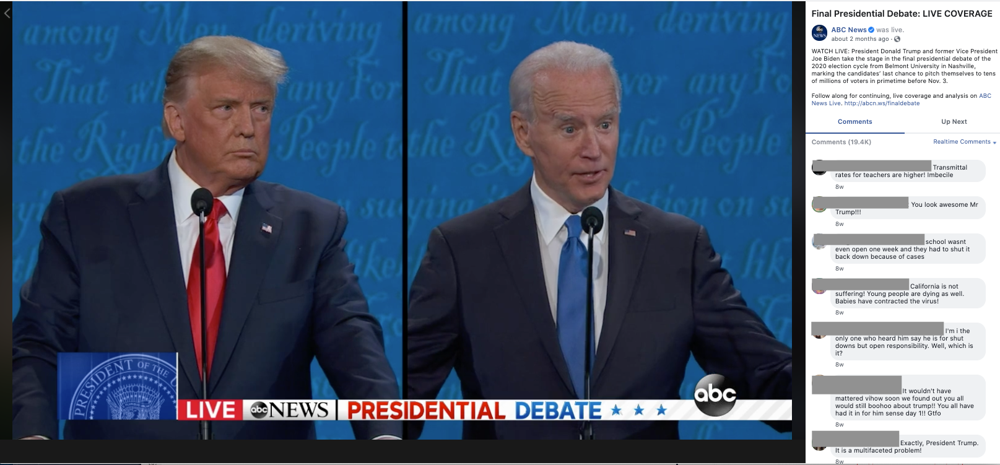


---
class: middle, center

### AOC

```{r echo=FALSE, out.width="50%"}
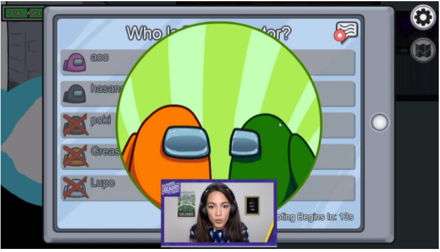
```

### Jair Bolsonaro

```{r echo=FALSE, out.width="50%"}
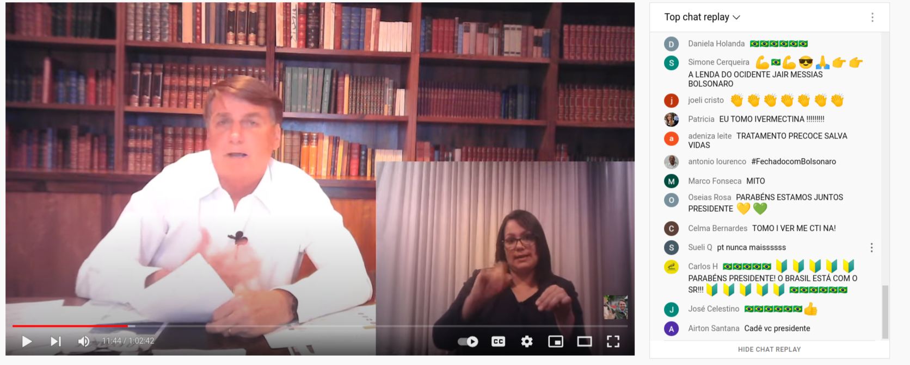
```

---
class: center, inverse

### Are we paying enough attention to these technologies?

<br><br>

```{r echo=FALSE, out.width = "60%"}
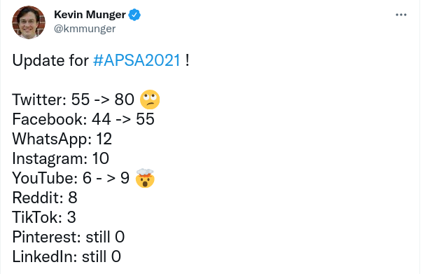

```
 
---
class: center, middle


### What are the effects of <a style="color:green"> streaming chats </a> on the public viewing experiences and political misperceptions? 

---
class:middle

## Streaming Chats and Perceptions of Political Debates


####.red[We combine a large scale ''field" experiment" with data scrapped from Facebook streaming chats.]


--

**Three main experimental conditions**

- Control (standard NBC broadcast)
- Expert chat (538 website)
- Streaming chat (Facebook)

--

.red[We then surveyed the respondents after the debate and measured the effects of streaming chats.]

.red[And collect comments from facebook streaming chatboxes.]

--

---
class:middle
## How are streaming chats different from dual screening ?

- **Different audience**. 6 out 10 young americans prefer to use online streaming to watch TV (Pew,  2017). 
  
- **Different Technology**: Chat streams at eye-level; only one, quick, and fast conversation. 

- **More cross-cutting information**: particularly on political debates

---
class: middle

- **Shift from polite (possibly partisan) broadcasters towards an experience similar to comments sections**: short comments, memes, others 

- **Chaotic Discussion**:Hard to sort, only see comments in the aggregate,   prone to lead to majority illusion.

- **Priming a very different set of issues**: most of them do not appear on the public discussions. 


---
class:middle

## How do streaming chats influence perceptions?


- **Frequency**: high volume of very short comments.

- **Toxicity**: almost anonymity and size of the comments are prone to high levels of toxicity. 

- **Content**: topics are mostly distinct from the ones discussed publicly during campaigns. 

- **Context**: comments' composition leads to inaccurate inferences of overall public.


---
class:inverse, middle, center

## Research Design

---
## Research Design and Sample

Two-Wave On-line Survey in September 2019 through MTurk (following Gross, Porter and Wood, 2019). 

**Wave 1 pre-debate survey with 2352 respondents**

- Identified respondents likely to watch debate, have Facebook account, could watch debate on a computer.

Encouraged 1095 eligible and interested participants to watch debate on randomly assigned platform.
    
**Wave 2 survey with 908 respondents**

- Analysis focuses on 576 Wave 2 Democratic respondents (including leaners) who watched at least part of the debate.

- N= 204 (Control), N= 174 (Expert), N= 198 (Social)

---

### Treatment Arms

.pull-left[]
.pull-right[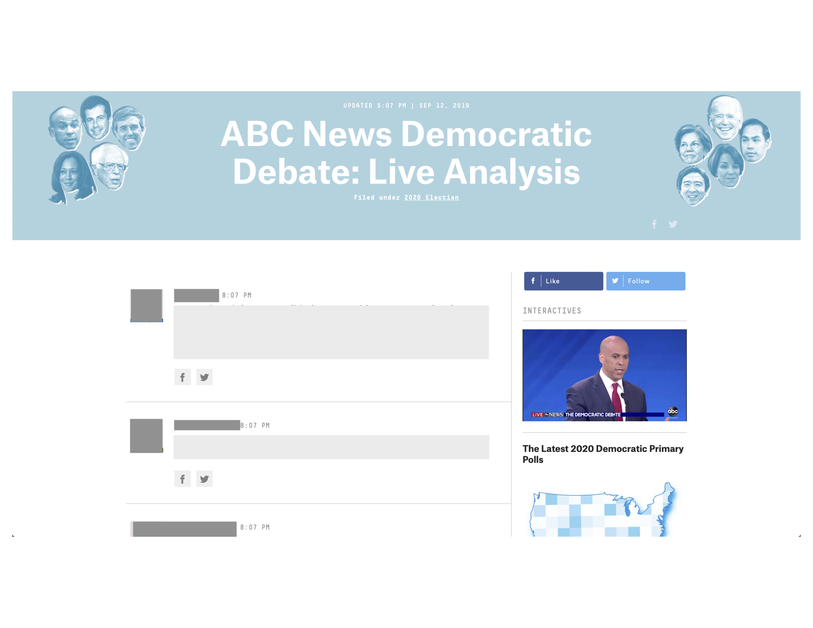]

.center[

```{r echo=FALSE, out.width = "60%"}
knitr::include_graphics("./figs/screenshot-abc.png")
```

]

---

## Text Analysis

To complement our analysis, we scrapped the comments on the two platforms. 

- 300 Comments on Expert + 6915 on Facebook. 

- Performed Dictionary Methods Sentiment Analysis. 

- Labeled the comments manually to identify topics. 

- Deep Learning Models to identify toxicity. 

---

## Hypotheses

<br><br>
```{r echo=FALSE}

d <- read.csv("figs/hyp.csv")

library(kableExtra)

d %>%
 kable(., "html", booktabs = T,align = c('c','l','l')) %>%
  kable_styling(latex_options = c("striped",
                                  "scale_down","repeat_header"),
                font_size = 14,
                # font_size = 12,
                full_width = T) %>% 
  column_spec(1, bold=T, width = '1in') %>% 
  column_spec(2,width = '3in') %>% 
  column_spec(3,width = '3in') 

```

---
class:inverse, middle, center

## Text Analysis: Validating Theoretical Premises

---
### High Frequency


.center[
```{r  echo=FALSE, out.width= '80%'}
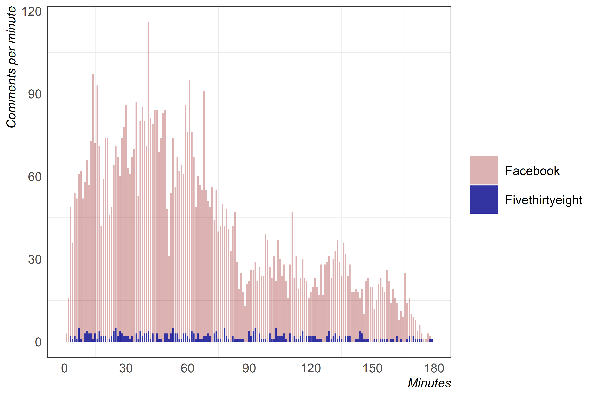
```
]
---
### Much more toxic:

.center[
```{r  echo=FALSE, out.width= '80%'}
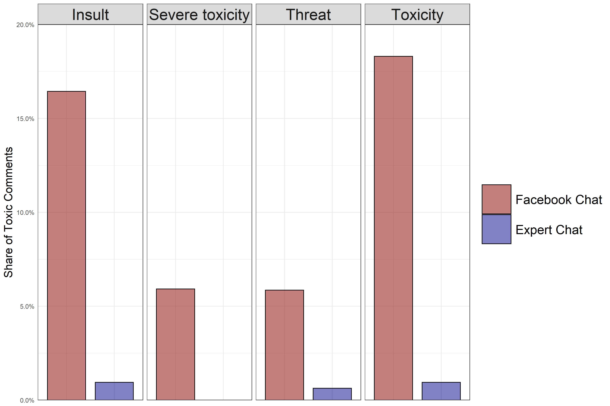
```
].footnote[Deep Learning Models from Google Perspective API]

---
### Contains Mostly Negative Primes

.center[
```{r  echo=FALSE, out.width= '80%'}
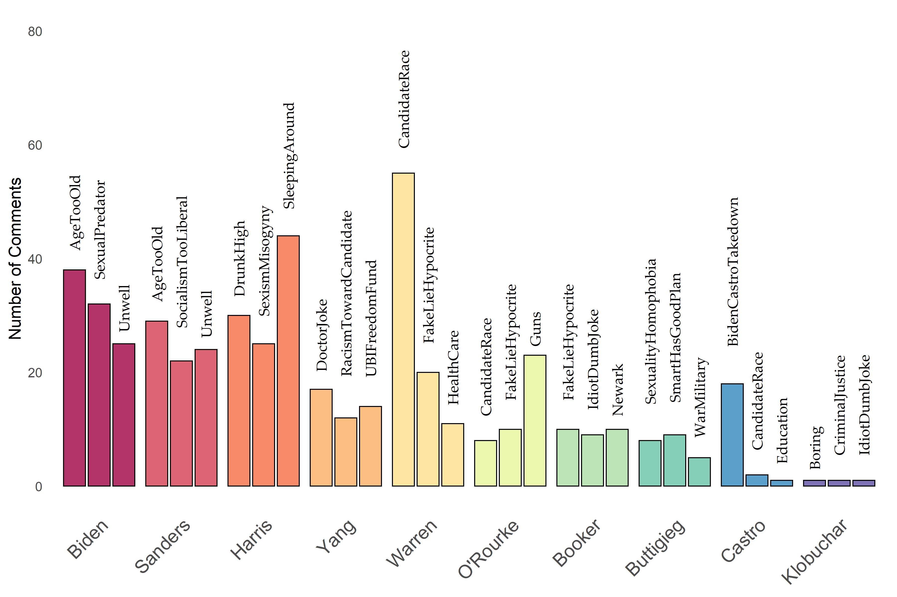
```
]

---
#### Mostly Negative Polarity about the Candidates

.center[
```{r  echo=FALSE, out.width= '80%'}
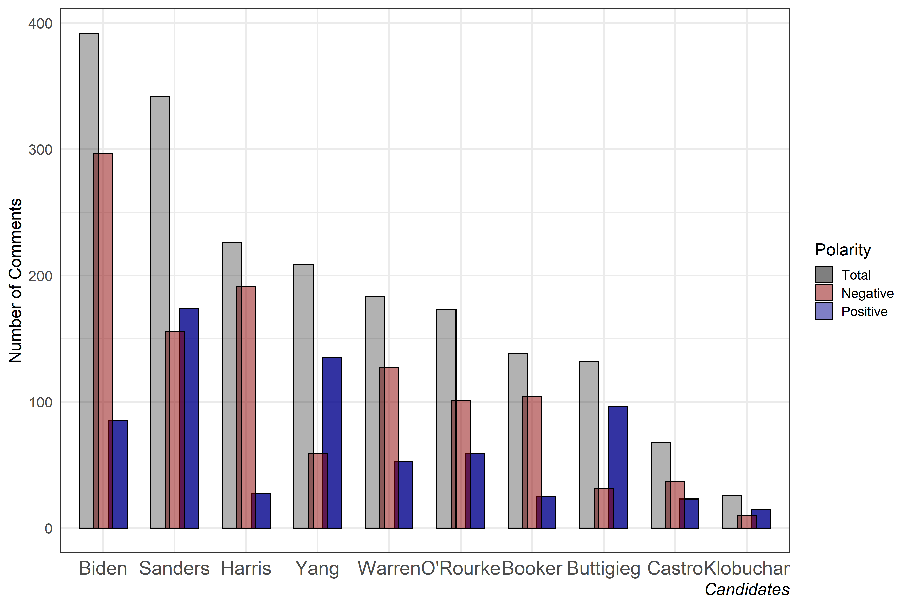
```
]

---
class:inverse, middle, center

## Experimental Results

---
## Frequency and Toxicity Hypotheses
.center[
Facebook chat somewhat less informative, enjoyable, and engaging
```{r  echo=FALSE, out.width= '80%'}
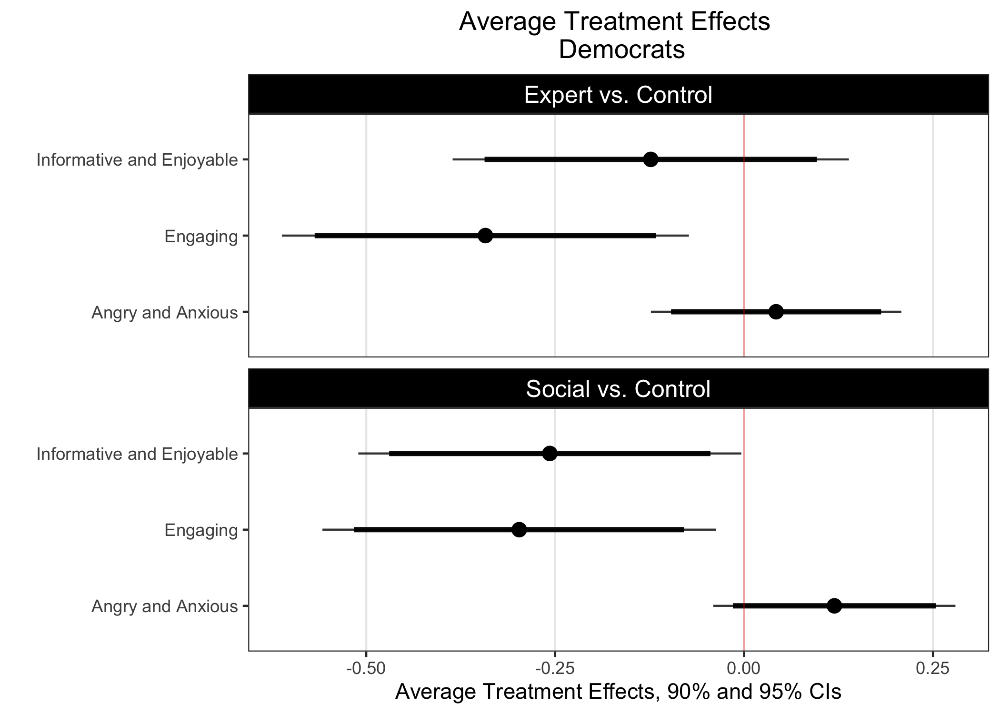
```
]

---
## Feeling Thermomethers about the Candidates

```{r  echo=FALSE, out.width= '80%'}
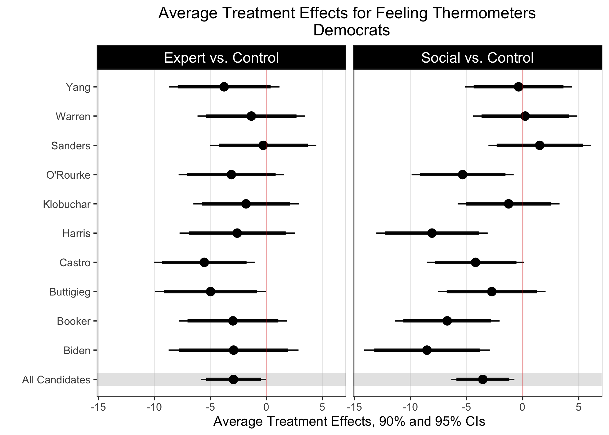
```

---
## Content Effect
.center[
```{r  echo=FALSE, out.width= '80%'}
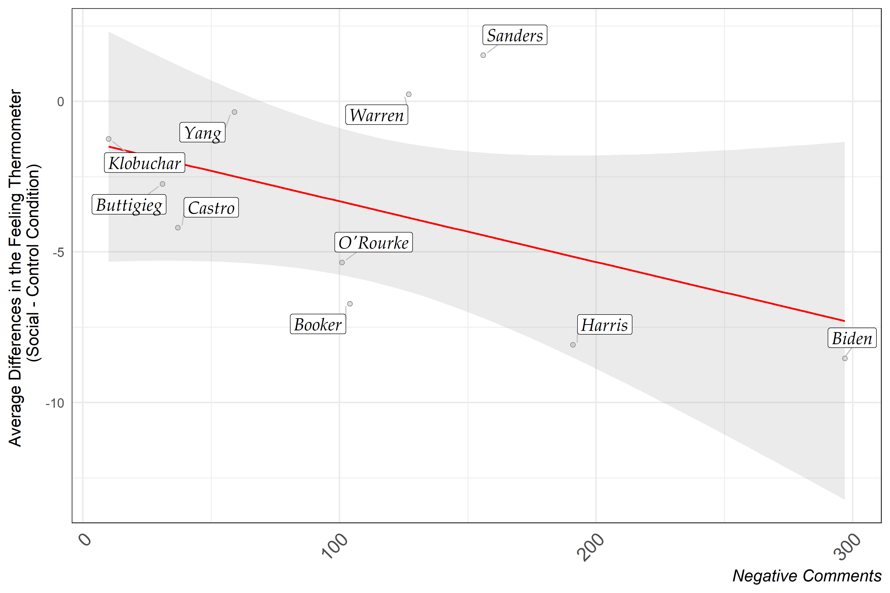
```
]


---
## Poll Performance

```{r  echo=FALSE, out.width= '80%'}
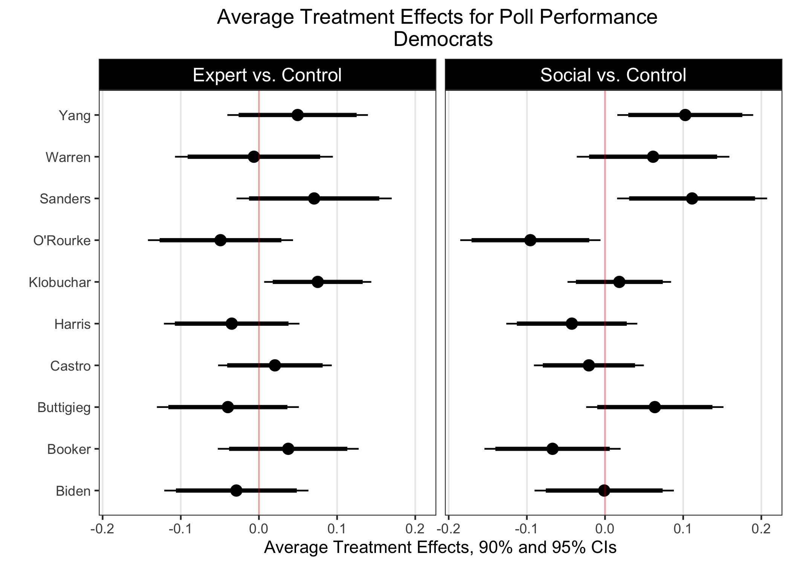
```

---
## Context Effect
.center[
```{r  echo=FALSE, out.width= '80%'}
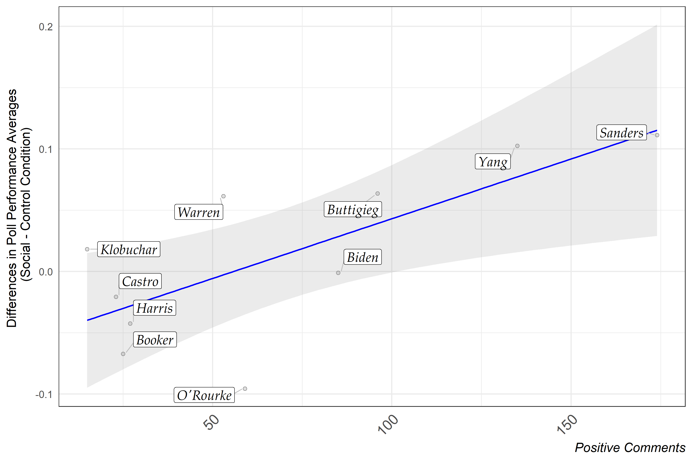
```
]

---
## Summary

.pull-left[
**Main Findings**:

- Creates worse viewing experience.

- Affects perceptions: 

      - Disproportionately negatively affect certain candidates subject to toxic, negative comments.
      
      - Distort inferences about candidate viability.

]

---
class: inverse, middle, center

### As these new technologies start to dominate broadcasting of political events, attracting particularly <a style:"color=red"> younger audiences </a>, we need more social science <a style:"color=red"> descriptive and causal research </a> about the effects on users' behavior. 

---
## Next Steps: Contextual cues and majority illusion. 

Python library to implement a visual setup for conjoint experiments with social media messages. Our team plans to use this tool to understand the effects of comments, reactions, and quotes on .red[majority illusion].


.pull-left[

```{r echo=FALSE, out.width="100%"}
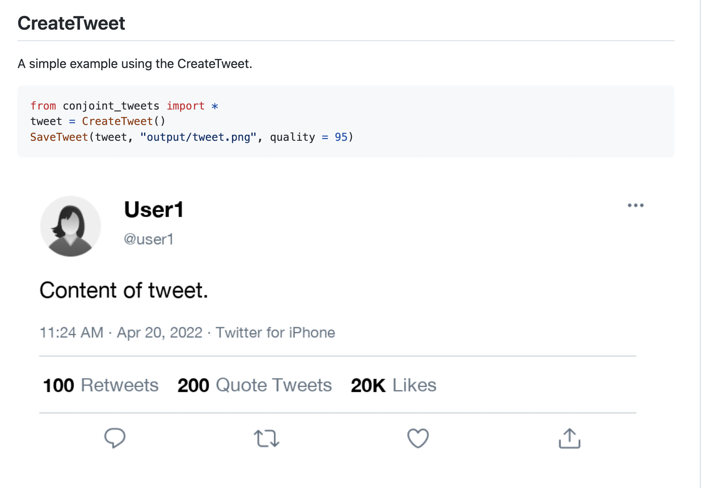
```
]

.pull-right[

```{r echo=FALSE, out.width="100%"}
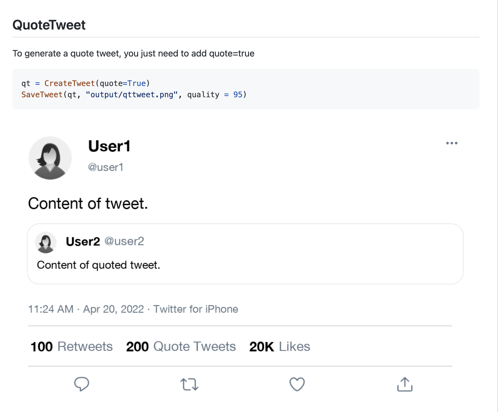
```
]