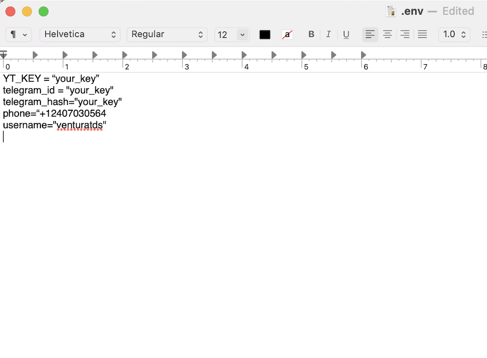

```{r setup, include=FALSE, echo=FALSE}
options(htmltools.dir.version = FALSE)
knitr::opts_chunk$set(messagwese=FALSE, warning = FALSE)
xaringanthemer::style_mono_light(base_color ="#23395b", 
                                  title_slide_text_color="#23395b", 
                                  title_slide_background_color = "#fff", 
                                  background_color = "#fff", 
                                  link_color =  "#C93312")
options(htmltools.dir.version = FALSE)
knitr::opts_chunk$set(message=FALSE, warning = FALSE, error=TRUE, echo=TRUE, cache=TRUE)
```

```{r style-share-again, echo=FALSE}
xaringanExtra::use_tile_view()
xaringanExtra::use_panelset()

#xaringanExtra::style_share_again(
#  share_buttons = c("twitter", "linkedin", "pocket")
#)
```

class:middle 

## Introduction

--

- This notebook walks through some code in Python and R to download and clean data from Telegram. 

--

- Telegram has become a very important social media messaging app, particularly in the Global South, as an alternative to WhatsApp.

--

- To capture Telegram data, we will use the Python library [telethon](https://docs.telethon.dev/en/stable/index.html). This library provides an access to telegram API, from which you can grab information from channels using your account.

--


---


## Get your Telegram API credentials

To connect to Telegram, we need an `api_id` and an `api_hash`. 


--

-  Login to your [Telegram core](https://my.telegram.org/) 

--

- Go to the [API development tools area](https://my.telegram.org/apps), and fill a request.

--

- Here’s short [tutorial](https://core.telegram.org/api/obtaining_api_id) about how to get your API credentials.

--

---

## Installing Telethon


```{python eval=FALSE}
#pip3 install telethon

```


---

## APIs Keys

Now, we will load our keys

```{python}
# call some libraries
import os
import datetime
import pandas as pd
from dotenv import load_dotenv

# get the keys
# load keys from  environmental var
load_dotenv() # .env file in cwd
telegram_id= os.environ.get("telegram_id")
telegram_hash= os.environ.get("telegram_hash")

# also need your cellphone and username from telegram
phone=os.environ.get("phone_number")
username= os.environ.get("username")

```
---
## Hidden Curriculum: What is the env file?

.center[
```{r echo=FALSE, out.width = "80%"}

```
]

---

## Log in to Telegram

Now everything is set up, we need to create a client and log in to our telegram account

```{python eval=FALSE}
# call packages
from telethon import TelegramClient #<<
from telethon.errors import SessionPasswordNeededError #<<
from telethon import sync #<<


# Create the client and connect
def telegram_start(username, api_id, api_hash):
  client = TelegramClient(username, api_id, api_hash)
  client.start()
  print("Client Created")
  # Ensure you're authorized
  if not client.is_user_authorized():
      client.send_code_request(phone)
      try:
          client.sign_in(phone, input('Enter the code: '))
      except SessionPasswordNeededError:
          client.sign_in(password=input('Password: '))
  return client        

# Tun the function
client = telegram_start(username, telegram_id, telegram_hash)

```

---
## Log in to Telegram


```{python eval=FALSE}
# call packages
from telethon import TelegramClient
from telethon.errors import SessionPasswordNeededError
from telethon import sync


# Create the client and connect
def telegram_start(username, api_id, api_hash): #<<
  client = TelegramClient(username, api_id, api_hash) #<<
  client.start() #<<
  print("Client Created")
  # Ensure you're authorized
  if not client.is_user_authorized():
      client.send_code_request(phone)
      try:
          client.sign_in(phone, input('Enter the code: '))
      except SessionPasswordNeededError:
          client.sign_in(password=input('Password: '))
  return client        

# Tun the function
client = telegram_start(username, telegram_id, telegram_hash)

```


---

## Log in to Telegram


```{python eval=FALSE}
# call packages
from telethon import TelegramClient
from telethon.errors import SessionPasswordNeededError
from telethon import sync


# Create the client and connect
def telegram_start(username, api_id, api_hash):
  client = TelegramClient(username, api_id, api_hash)
  client.start() 
  print("Client Created")
  # Ensure you're authorized
  if not client.is_user_authorized():
      client.send_code_request(phone)
      try:
          client.sign_in(phone, input('Enter the code: '))
      except SessionPasswordNeededError:
          client.sign_in(password=input('Password: '))
  return client        

# Tun the function
client = telegram_start(username, telegram_id, telegram_hash) #<<

```

---

### Getting Channel Members

```{python eval=FALSE}
from telethon.tl.functions.channels import GetParticipantsRequest
from telethon.tl.types import ChannelParticipantsSearch
from telethon.tl.types import (PeerChannel)

# Let's get members of the Lula Channel on Telegram
input_channel = "https://t.me/UrnasEletronicaseEleicoesBrasil" #<<

## Getting information from channel 
my_channel = client.get_entity(input_channel) #<<
```

---
### Getting Channel Members


```{python  eval=FALSE}
## get channel members
offset = 0
limit = 500
all_participants = []

while True:
    participants = client(GetParticipantsRequest( #<<
        my_channel, ChannelParticipantsSearch(''), offset, limit, #<<
        hash=0 #<<
    ))
    if not participants.users:
        break
    all_participants.extend(participants.users)
    offset += len(participants.users)

```

---

### Cleaning channel members

```{python eval=FALSE}
# Open Json
all_user_details = []
for participant in all_participants:
    all_user_details.append(
        {"id": participant.id, "first_name": participant.first_name, "last_name": participant.last_name,
         "user": participant.username, "phone": participant.phone, "is_bot": participant.bot})

# Check it our
df = pd.DataFrame(all_user_details)

```

---
### Getting Channel Members

.
```{python}
import pandas as pd
df = pd.read_csv("data_telegram/user.csv",)
df.keys()
df.head()

```

---

### Getting Messages


```{python eval=FALSE}
from telethon.tl.functions.messages import (GetHistoryRequest)
from telethon.tl.types import (PeerChannel)

offset_id = 0
limit = 1000
all_messages = []
total_messages = 0
total_count_limit = 0

# capture data
history = client(GetHistoryRequest( #<<
        peer=my_channel,offset_id=offset_id, #<<
        offset_date=None,add_offset=0, #<<
        limit=limit,max_id=0,min_id=0,hash=0)) #<<
    
# get messages objects
messages = history.messages

# convert to a dictionary
for message in messages:
      all_messages.append(message.to_dict())

# save json
with open('data_telegram/message_data.json', 'w') as outfile:
    json.dump(all_messages, outfile, indent=4, sort_keys=True, default=str)


```


---

### Quick data cleaning
```{python}
import pandas as pd
import json
# convert to pandas
# Opening JSON file
f = open('data_telegram/message_data.json')
  
# returns JSON object as 
# a dictionary
data = json.load(f)
 
df = pd.DataFrame(data)
df.keys()

```

---

### Quick data cleaning

```{python}
# open nested lists
df = pd.concat([df, df["from_id"].apply(pd.Series)], axis=1) #<<

# See
df.head()

```

---
class:middle

### Conclusion

This was a very introduction introduction. If you want to do this at scale, you need to 

- Curate a list of channels you are interested in. 

- Host this code in a server so that you can make multiple calls over the days. 

- Use the async package to make this code more efficient. 
