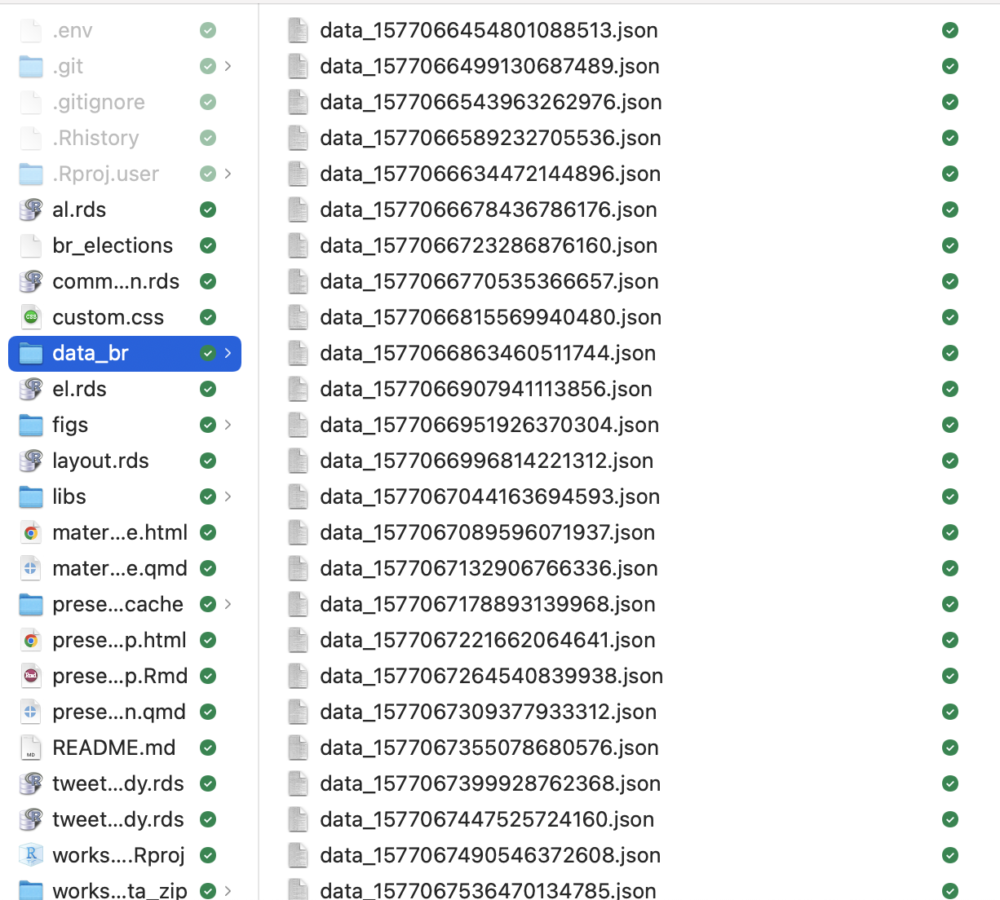
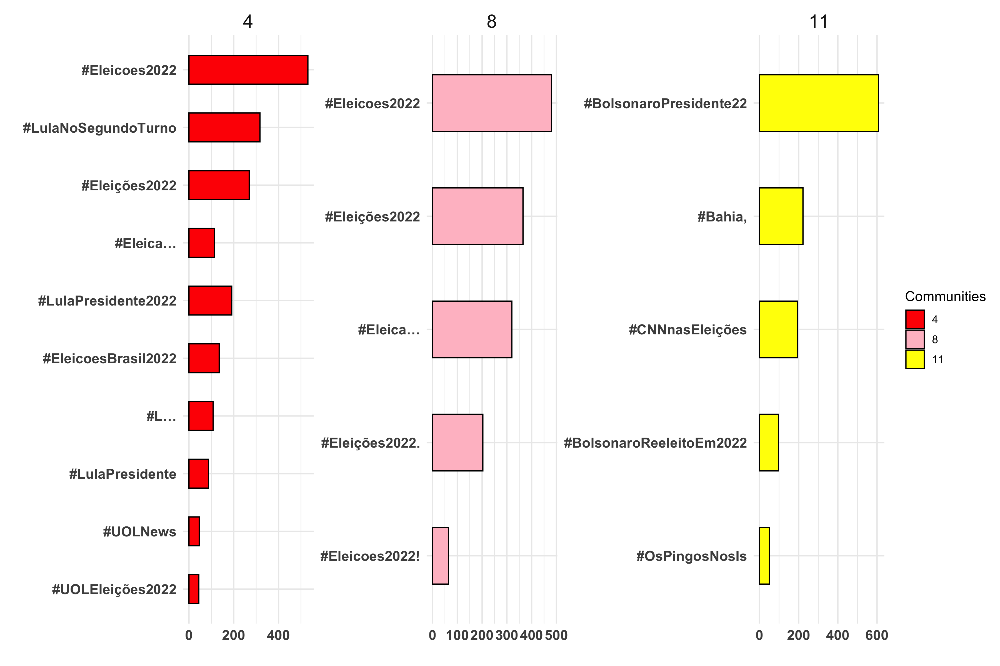
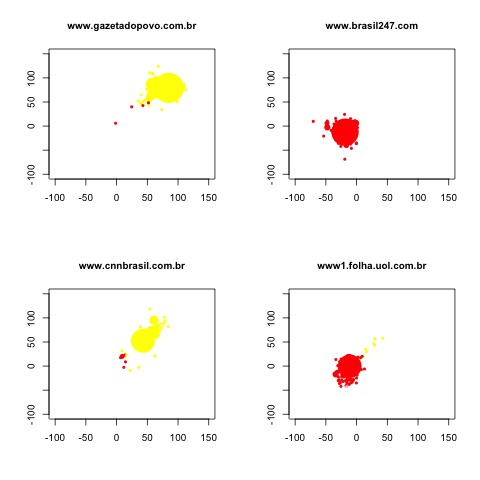

```{r setup, include=FALSE, echo=FALSE}
options(htmltools.dir.version = FALSE)

knitr::opts_chunk$set(messagwese=FALSE, warning = FALSE)
xaringanthemer::style_mono_light(base_color ="#23395b", 
                                  title_slide_text_color="#23395b", 
                                  title_slide_background_color = "#fff", 
                                  background_color = "#fff", 
                                  link_color =  "#C93312")
options(htmltools.dir.version = FALSE)
knitr::opts_chunk$set(message=FALSE, warning = FALSE, error=TRUE, echo=TRUE, cache=TRUE)
```

```{r style-share-again, echo=FALSE}
xaringanExtra::use_tile_view()
xaringanExtra::use_panelset()

#xaringanExtra::style_share_again(
#  share_buttons = c("twitter", "linkedin", "pocket")
#)
```

name: about-me
layout: false
class: about-me-slide, inverse, middle, center


## .red[About me]


### Tiago Ventura

### Postdoc at Center for Social Media and Politics

.fade[Incoming Assistant Professor, McCourt School, Georgetown University]

[`r icons::simple_icons("twitter")` @TiagoVentura_](https://twitter.com/_Tiagoventura)
[`r icons::simple_icons("github")` TiagoVentura](https://github.com/TiagoVentura)
[`r icons::ionicons("mail")` venturat@umd.edu](venturat@umd.edu)
[`r icons::ionicons("link-outline")`https://tiagoventura.rbind.io/](https://venturatiago.com/)

---
class:middle

## Plans for the Workshop


--

### Twitter Data

- Collecting data using the Academic Access through [academictwitteR](https://github.com/cjbarrie/academictwitteR)  in R
- Some bits of network analysis

--

### Youtube Data. 

-  [Python Library](https://youtube-data-api.readthedocs.io/en/latest/youtube_api.html) developed by Megan Brown, Senior Engenieer at the Center for Social Media and Politics at NYU, and some other colleagues. 

--

### Telegram Data

- [Python module Telethon](https://docs.telethon.dev/en/stable/index.html).

--

---
class: middle

# One-hour workshop

.center[
```{r  echo=FALSE, out.width = "50%"}
 
```
]

---
class: middle

# Some assumptions

--

- Assume some knowledge of R and Python. 

--

- We will not go through authentication with Twitter and Youtube APIs (instructions are provided for you to go through it later)

--

- Particularly for Youtube and Telegram, I will just showcase others' people library to access data from these platforms.

--

---
class:middle

##  Logistics

All materials are available in the Github repo for the workshop: [https://github.com/TiagoVentura/workshop_big_data_conference](https://github.com/TiagoVentura/workshop_big_data_conference). 

You can just clone all the files from there. 

More: 

- Slides: [Twitter](https://tiagoventura.github.io/workshop_big_data_conference/presentation_workshop_twitter.html), [Youtube](https://tiagoventura.github.io/workshop_big_data_conference/presentation_workshop_youtube.html), [Telegram](https://tiagoventura.github.io/workshop_big_data_conference/presentation_workshop_telegram.html)

- Notebooks:[Twitter](https://tiagoventura.github.io/workshop_big_data_conference/notebook_twitter.html), [Youtube](https://tiagoventura.github.io/workshop_big_data_conference/notebook_youtube.html), [Telegram](https://tiagoventura.github.io/workshop_big_data_conference/notebook_telegram.html)

---
class:inverse, middle

# Gathering and Analyzing Twitter Data

---
class:middle

## Getting Access to the Twitter APIs.

--

- [Apply for a Twitter developer account](https://developer.twitter.com/en/apply-for-access). 

- [Apply to the academic research product track](https://developer.twitter.com/en/portal/petition/academic/is-it-right-for-you). 

- Save your keys in a local file in your computer. 
--

---
class:middle

## Standard Access

- Search for Tweets from the last 7 days.

- Stream Tweets in real-time 

- Get Tweets from a user’s timeline (up to 3200 most recent Tweets)

- Build the full Tweet objects from a Tweet ID, or a set of Tweet IDs

- Look up follower relationships

---
class:middle

## Academic Research product track

- Ability to get historical Tweets.

- Cap of 10 million Tweets per month

- More advanced filter options to return relevant data.

---
class:middle

## Collecting Twitter Data

--

- **For R users:** [academictwitteR](https://github.com/cjbarrie/academictwitteR) package developed by Chris Barrie.

- **For Python User:** check the library [Twarc](https://twarc-project.readthedocs.io/en/latest/). 


---

## Access tweets from the archive

#### Load Packages
```{r call packages}
# Call packages using pacman
#install.packages("pacman")
pacman::p_load(here, jsonlite, tidyverse, academictwitteR)
```


#### Add your API Key
```{r add key , eval=FALSE}
# Using Academic Twitter to add yourkey
set_bearer() #<<
```

---
class:middle

## get_all_tweets


```{r get all tweets, eval=FALSE}
# Using Academic Twitter to add yourkey
# Collect data
tweets <-
  get_all_tweets(
    query = "(eleicoes2022 OR lula OR bolsonaro OR ciro OR tebet)",  #<<
    start_tweets = "2022-10-01T00:00:00Z", #start time
    end_tweets = "2022-10-04T00:00:00Z", #end time
    file = "br_elections", # file to save
    data_path = "data_br/", # folder where all data as jsons will be stores
    n = 200000, # number of tweets
    lang = "pt"
  )
```

---
class:middle

## get_all_tweets


```{r, eval=FALSE}
# Using Academic Twitter to add yourkey
# Collect data
tweets <-
  get_all_tweets(
    query = "(eleicoes2022 OR lula OR bolsonaro OR ciro OR tebet)",  
    start_tweets = "2022-10-01T00:00:00Z", #start time #<<
    end_tweets = "2022-10-04T00:00:00Z", #end time #<<
    file = "br_elections", # file to save
    data_path = "data_br/", # folder where all data as jsons will be stores
    n = 200000, # number of tweets
    lang = "pt"
  )
```

---
class:middle

## get_all_tweets


```{r , eval=FALSE}
# Using Academic Twitter to add yourkey
# Collect data
tweets <-
  get_all_tweets(
    query = "(eleicoes2022 OR lula OR bolsonaro OR ciro OR tebet)", 
    start_tweets = "2022-10-01T00:00:00Z", #start time
    end_tweets = "2022-10-04T00:00:00Z", #end time
    file = "br_elections", 
    data_path = "data_br/", #<<
    n = 200000, # number of tweets
    lang = "pt"
  )
```

---
class:middle

## get_all_tweets


```{r , eval=FALSE}
# Using Academic Twitter to add yourkey
# Collect data
tweets <-
  get_all_tweets(
    query = "(eleicoes2022 OR lula OR bolsonaro OR ciro OR tebet)",  
    start_tweets = "2022-10-01T00:00:00Z", #start time
    end_tweets = "2022-10-04T00:00:00Z", #end time
    file = "br_elections", # file to save
    data_path = "data_br/", # folder where all data as jsons will be stores
    n = 200000,  #<<
    lang = "pt"
  )
```


---
## What else?


.center[
```{r acad_opt,  echo=FALSE, out.width = "60%"}
knitr::include_graphics("figs/acad_opt.png") 
```
]

---
## Where does the data live?

.center[
```{r showing data,  echo=FALSE, out.width = "80%"}
 
```
]

---
## bind_tweets: tidy

```{r bind_tweets, eval=FALSE}
# data processing
tweets_tidy <- bind_tweets("./data_br", output_format = "tidy") #<<
tweets_tidy
```


```{r bind_tweets_rds, echo=FALSE}
# data processing
tweets_tidy <- read_rds("tweets_tidy.rds") 
head(tweets_tidy)
```

---

## bind_tweets: json

```{r bind_tweet_json, eval=FALSE}
# examing the data
tweets_raw <- bind_tweets("./data_br", 
                output_format = "raw") #<<
str(tweets_raw, max.level=1)
```

```{r bind_tweets_json_rds, echo=FALSE}
# data processing
tweets_raw <- read_rds("tweets_raw_tidy.rds")
str(tweets_raw, max.level=1)
```
---
class:middle
## Network Analysis with Twitter Data

Many different ways you can analyze Twitter data: the text, the images, the geolocation, links, among many other things. 


A popular way is to  to look at the user connections using some sort of network models.  Not limited to Twitter data. 


A network has two core elements: nodes and edges. On Twitter this means:

- Nodes are Twitter users

- Edges are any sort of connections these users make. A reply, a friendship, or the most common, a retweet. 

[igraph](https://igraph.org/r/) package to analyze network data in R. 

---
class:middle, inverse

## Intro to  Network Analysis in R

---

### Step 1: Filter Nodes

.panelset[
.panel[.panel-name[Code]

```{r eval=FALSE}
# Filter retweets
tweets_tidy_rt <- tweets_tidy %>%
                  filter(!is.na(sourcetweet_type)) #<<

# Visualize the dta
tweets_tidy_rt %>%
  select(user_username,
  sourcetweet_author_id) %>%
  head()

```
]
.panel[.panel-name[Output]

```{r filter_nodes, echo=FALSE}
# Filter retweets
tweets_tidy_rt <- tweets_tidy %>%
                  filter(!is.na(sourcetweet_type))

# Visualize the dta
tweets_tidy_rt %>%
  select(user_username, 
  sourcetweet_author_id) %>%
  head()

```
]
]

---

## Step 2: Create a edge list

.panelset[
.panel[.panel-name[Code]

```{r eval=FALSE}
# Create a edge list 
data <- cbind(tweets_tidy_rt$author_id, #<<
        tweets_tidy_rt$sourcetweet_author_id) #<<

```
]

.panel[.panel-name[Output]

```{r edge_list,echo=FALSE}
# Create a edge list 
# using the user id on both sides here to keep the same unit

data <- cbind(tweets_tidy_rt$author_id, tweets_tidy_rt$sourcetweet_author_id)
head(data)

```
]
]
---

## Step 3: Create your network structure

.panelset[
.panel[.panel-name[Code]


```{r eval=FALSE}
pacman::p_load(igraph)

# Create an empty network

net <- graph.empty() #<<

# Add nodes
net <- add.vertices(net, #<<
        length(unique(c(data))), # number of nodes
        name=as.character(unique(c(data)))) # unique names

# Add edges
net <- add.edges(net, t(data)) #<<

# summary
summary(net)

```
]

.panel[.panel-name[Output]


```{r network, echo=FALSE}
pacman::p_load(igraph)

# Create an empty network

net <- graph.empty() 

# Add nodes
net <- add.vertices(net, 
                    length(unique(c(data))), # number of nodes
                    name=as.character(unique(c(data)))) # unique names

# Add edges
net <- add.edges(net, t(data))

# summary
summary(net)

```
]
]
---

## Step four: Add information to your network object


Edge level (`E(object)`)  or  Node leve (`V(object)`). 

.panelset[
.panel[.panel-name[Code]
```{r add_var_to_net}
library(urltools)

# Edges 
E(net)$text <- tweets_tidy_rt$text #<<
E(net)$idauth <- tweets_tidy_rt$sourcetweet_author_id #<<
E(net)$namehub <- tweets_tidy_rt$user_username #<<


# Capturing hashtags
E(net)$hash <- str_extract_all(tweets_tidy_rt$text,
                               "#\\S+")
```
]
.panel[.panel-name[Accessing the raw]

```{r accessing_raw}
# grab expanded and unwound_url
entities <- tweets_raw$tweet.entities.urls #<<
entities 
```
]

.panel[.panel-name[Capturing Domains]

```{r capt_domains}
## Capturing domains
tidy_entities <- entities %>% 
                    # get columns we need
                    select(tweet_id, unwound_url) %>% 
                    #extract domains
                    mutate(unwound_url=domain(unwound_url)) %>%
                    # remove nas and 
                    # combine multiple links
                    filter(!is.na(unwound_url)) %>%
                    group_by(tweet_id) %>%
                    summarise(domain=paste0(unwound_url, collapse=" -- ")) #<<

# Merge back with id
tweets_tidy_rt <- left_join(tweets_tidy_rt, tidy_entities)

# add to the network
E(net)$domain <- tweets_tidy_rt$domain #<<
```
]

.panel[.panel-name[Output]

```{r echo=FALSE}
summary(net)
```
]
]

---
class: middle
## Network Statistics, Communities and Layout

Two very common concepts in network science are in-degree and out-degree. 

- In-degree refers to how many links pointing to themselves the user has.

- Out-degree means how many retweets the user has given.

A user is called an authority when their in-degree is high. 

- A user is called a hub when its out-degree is high, as this user retweets very often.

---
class: middle

## Degree Statistics
```{r}
# Calculate in degree and out degree
V(net)$outdegree<-degree(net, mode="out") #<<
V(net)$indegree<-degree(net, mode="in") #<<
summary(net)
```

---
class: middle
### Layout

```{r eval=FALSE}
l <- layout_with_fr(net, grid = c("nogrid")) #<<
#saveRDS(l, "layout.rds")
head(l)
```

```{r echo=FALSE}
l <- read_rds("layout.rds") 
head(l)
```

---
class: middle

### Communities


```{r eval=FALSE}
my.com.fast <- walktrap.community(net) #<<
str(my.com.fast, max.level = 1)
```

```{r echo=FALSE}
my.com.fast <- read_rds("community_detection.rds")
str(my.com.fast, max.level = 1)
```

---
class: middle

## Add the layout and membership to your igraph object. 

```{r}
V(net)$l1 <- l[,1] #<<
V(net)$l2 <- l[,2] #<<
V(net)$membership <- my.com.fast$membership #<<
```

---

## What are the largest communities?

.panelset[
.panel[.panel-name[Code]

```{r eval=FALSE}

comunidades<- data_frame(membership=V(net)$membership)

comunidades %>% 
    count(membership) %>% 
    arrange(desc(n)) %>%
    top_n(5)


```

]

.panel[.panel-name[Output]

```{r comm, echo=FALSE}

comunidades<- data_frame(membership=V(net)$membership)

comunidades %>% 
    count(membership) %>%
    arrange(desc(n)) %>%
    top_n(5)


```

]
]

---

## Who are the main authorities in each community?

.panelset[
.panel[.panel-name[Code]

```{r autoridade}
# Create an datafram for the authoritiew
authorities <- data_frame(name=V(net)$name, #<<
                ind=V(net)$indegree, #<<
                membership=V(net)$membership) %>% #<<
                filter(membership==11| 
                       membership==4|
                       membership==8) %>%
                group_by(membership) %>%
                arrange(desc(ind)) %>% 
                slice(1:10)

```
]

.panel[.panel-name[Authorities names]

```{r}
# I will get only from the 100 most retweeted to save some time. 
users_most_retweets <-authorities %>%
                      mutate(data_user=map(name,
                             get_user_profile)) %>% #<<
                      unnest()
```

]
]

---
## Who are the main authorities in each community?

.panelset[
.panel[.panel-name[ggplot code]

```{r eval=FALSE}
# Main Communities
ggplot(users_most_retweets %>% 
         filter(membership=="4"), #<<
         aes(x=reorder(username,
                ind,
             fill=membership),
                     y=ind)) + 
    geom_histogram(stat="identity", width=.5, color="black") +
    coord_flip() +
    xlab("") + ylab("") + 
    theme_minimal(base_size = 12) + 
    theme(plot.title = element_text(size = 22, face = "bold"), 
          axis.title=element_text(size=16), 
          axis.text = element_text(size=12, face="bold")) +
    facet_grid(~membership)
```
]

.panel[.panel-name[Community I]
.center[

```{r echo=FALSE,  out.width="50%"}
# Main Communities
ggplot(users_most_retweets %>% 
         filter(membership=="4"),
       aes(x=reorder(username,
           ind, 
          fill=membership),
                     y=ind)) + 
    geom_histogram(stat="identity", width=.5, color="black") +
    coord_flip() +
    xlab("") + ylab("") + 
    theme_minimal(base_size = 12) + 
    theme(plot.title = element_text(size = 22, face = "bold"), 
          axis.title=element_text(size=16), 
          axis.text = element_text(size=12, face="bold")) +
    facet_grid(~membership)
```
]
]

.panel[.panel-name[Community II]
.center[

```{r echo=FALSE,  out.width="50%"}
# Main Communities
ggplot(users_most_retweets %>% filter(membership=="8"), aes(x=reorder(username,
                               ind, 
                               fill=membership),
                     y=ind)) + 
    geom_histogram(stat="identity", width=.5, color="black") +
    coord_flip() +
    xlab("") + ylab("") + 
    theme_minimal(base_size = 12) + 
    theme(plot.title = element_text(size = 22, face = "bold"), 
          axis.title=element_text(size=16), 
          axis.text = element_text(size=12, face="bold")) +
    facet_grid(~membership)
```
]
]
.panel[.panel-name[Community III]
.center[
```{r echo=FALSE, out.width="50%"}
# Main Communities
ggplot(users_most_retweets %>% filter(membership=="11"), aes(x=reorder(username,
                               ind, 
                               fill=membership),
                     y=ind)) + 
    geom_histogram(stat="identity", width=.5, color="black") +
    coord_flip() +
    xlab("") + ylab("") + 
    theme_minimal(base_size = 12) + 
    theme(plot.title = element_text(size = 22, face = "bold"), 
          axis.title=element_text(size=16), 
          axis.text = element_text(size=12, face="bold")) +
    facet_grid(~membership)
```
]
]
]

---

## Visualizing communities

.panelset[
.panel[.panel-name[Function to Plot Network]
```{r net_function}

# A function with the density. Nice to visualize as well.
my.den.plot <- function(l=l,new.color=new.color, ind=ind, legend, color){
  library(KernSmooth)
  est <- bkde2D(l, bandwidth=c(10, 10))
  plot(l,cex=log(ind+1)/4, col=new.color, pch=16, xlim=c(-160,140),ylim=c(-140,160), xlab="", ylab="", axes=FALSE)
   legend("topright", c(legend[1],legend[2], legend[3]), pch = 17:19, col=c(color[1], color[2], color[3]))
  contour(est$x1, est$x2, est$fhat,  col = gray(.6), add=TRUE)
} 
```
]

.panel[.panel-name[Function to Plot Network]

```{r netcomm_colors}
# Colors for each community

# Building a empty containes
temp <- rep(1,length(V(net)$membership))
new.color <- "white"
new.color[V(net)$membership==11] <- "Yellow" #<<
new.color[V(net)$membership==8] <- "pink"#<<
new.color[V(net)$membership==4] <- "red"#<<

# Add color
V(net)$new.color <- new.color
```
]

.panel[.panel-name[Network Plot]

```{r net_plot_, echo=FALSE}

# A function with the density. Nice to visualize as well.
my.den.plot <- function(l=l,new.color=new.color, ind=ind, legend, color){
  library(KernSmooth)
  est <- bkde2D(l, bandwidth=c(10, 10))
  plot(l,cex=log(ind+1)/4, col=new.color, pch=16, xlim=c(-160,140),ylim=c(-140,160), xlab="", ylab="", axes=FALSE)
   legend("topright", c(legend[1],legend[2], legend[3]), pch = 17:19, col=c(color[1], color[2], color[3]))
  contour(est$x1, est$x2, est$fhat,  col = gray(.6), add=TRUE)
  #text(-140,115,paste("ENCG: ",ENCG,sep=""), cex=1, srt=0)
} 

# Crie as cores para cada comunidade

# Building a empty containes
temp <- rep(1,length(V(net)$membership))
new.color <- "white"
new.color[V(net)$membership==11] <- "Yellow" ####
new.color[V(net)$membership==8] <- "pink" ####
new.color[V(net)$membership==4] <- "red" ####

# Adiciona a nova cor
V(net)$new.color <- new.color

# Plot
my.den.plot(l=cbind(V(net)$l1,V(net)$l2),new.color=V(net)$new.color, ind=V(net)$indegre, legend =c("Pro-Bolsonaro", "Anti-Bolsonaro I", "Anti-Bolsonaro II"), 
color =c("Yellow", "red", "pink"))

```
]
]

---
## Hashtags by communities

.center[
```{r eval=FALSE, echo=FALSE, out.width="60%"}
# get communities
auth <- data_frame(name=V(net)$name, membership=V(net)$membership)

# merge

data_hash <- tweets_tidy_rt %>%
                    left_join(auth, by=c("author_id"="name")) %>%
                    mutate(hashtags=str_extract_all(tweets_tidy_rt$text, "#\\S+")) %>%
                    unnest(hashtags) %>%
                    drop_na(hashtags)
      

# Vamos aggrupar por comunidade
hash_by_comm <- data_hash %>%
                           filter(membership==11| membership==8|membership==4) %>%
                           count(membership, hashtags) %>%
                           top_n(20, n)


ggplot(hash_by_comm, aes(x=reorder(hashtags,
                               n),
                     y=n, fill=as.factor(membership))) + 
  geom_histogram(stat="identity", width=.5, color="black") +
  coord_flip() +
    xlab("") + ylab("") + 
  scale_fill_manual(name="Communities", values=c("Red", "pink", "Yellow")) +
  theme_minimal(base_size = 10) + 
  facet_wrap(~membership, scale="free") 

```
]

.center[
```{r  echo=FALSE, out.width = "100%"}
 
```
]

---
## Sharing news on Twitter

.footnote[From [News Sharing, Gatekeeping, and Polarization: A Study of the #Bolsonaro Election](https://www.tandfonline.com/doi/full/10.1080/21670811.2020.1852094)]


.center[
```{r  echo=FALSE, out.width = "60%"}
 
```
]

---

class:middle

## Other APIs endpoints

Most of our work with the Twitter API happens with the capacity to query the API with search terms. For this reason, the search (and filter for live data collection) endpoints are the most popular. 

However, there are a few other endpoints from the Twitter API that can also be very useful for research puporses. Let's walk through them briefly. 


---
## Getting user id

Imagine a research in which you have the Twitter accounts of elites, and you want to collect their Twitter data. The first step is to collect their ids. 

```{r}
# getting some Twitter Ids
pelosi <- get_user_id("SpeakerPelosi") #<<
pelosi
```

---
## Getting whom a user follows

```{r}
pelosi_network <- get_user_following(pelosi)#<<
glimpse(pelosi_network)
```

---

## Estimate user ideology
.panelset[
.panel[.panel-name[Code]

```{r}
#devtools::install_github("pablobarbera/twitter_ideology/pkg/tweetscores")
library(tweetscores)
results <- estimateIdeology("SpeakerPelosi", pelosi_network$id, verbose = FALSE)#<<
```
]
.panel[.panel-name[Output]
.center[
```{r, out.width="50%"}
plot(results)
```
]
]
]

---
## User timeline

```{r}
pelosi_tl = get_user_timeline(pelosi, 
                              start_tweets = "2022-01-01T00:00:00Z", #<<
                               end_tweets = "2022-10-22T00:00:00Z", #<<
                              n=100) #limit
glimpse(pelosi_tl)
```

---

## Tweets liked by an user

```{r}
pelosi_likes = get_liked_tweets(pelosi) #<<
glimpse(pelosi_likes) # she mostly liked her own tweets

```

---
class:inverse, middle

# Question?

---
class:inverse, middle

## That's a wrap for Twitter data

See [here](https://tiagoventura.github.io/workshop_big_data_conference/presentation_workshop_youtube.html) the link for the Youtube slides