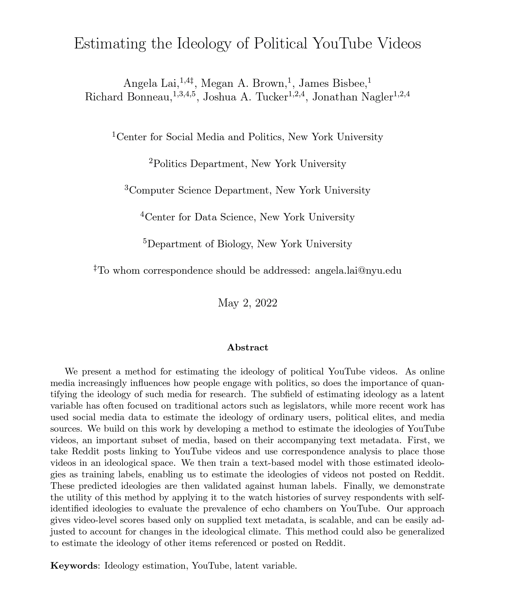
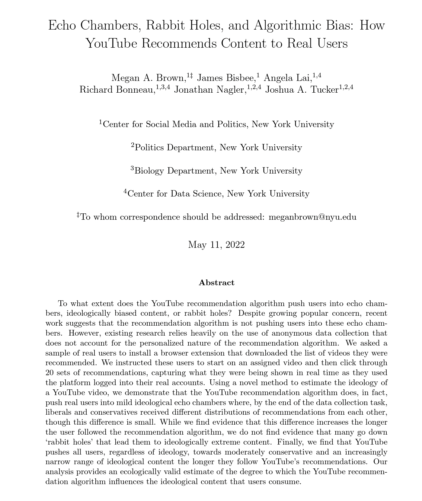

```{r setup, include=FALSE, echo=FALSE}
options(htmltools.dir.version = FALSE)

knitr::opts_chunk$set(messagwese=FALSE, warning = FALSE)
xaringanthemer::style_mono_light(base_color ="#23395b", 
                                  title_slide_text_color="#23395b", 
                                  title_slide_background_color = "#fff", 
                                  background_color = "#fff", 
                                  link_color =  "#C93312")
options(htmltools.dir.version = FALSE)
knitr::opts_chunk$set(message=FALSE, warning = FALSE, error=TRUE, echo=TRUE, cache=TRUE)
```

```{r style-share-again, echo=FALSE}
xaringanExtra::use_tile_view()
xaringanExtra::use_panelset()

#xaringanExtra::style_share_again(
#  share_buttons = c("twitter", "linkedin", "pocket")
#)
```


class:inverse, middle

# Collecting and Analyzing Youtube Data

---
class:middle

What I am presenting here follows very closely the [notebook](https://github.com/SMAPPNYU/krn_tools_demo/blob/main/youtube_data_api_demo.ipynb) and [Python Library](https://pypi.org/project/youtube-data-api/) developed by Megan Brown, Senior Engineer at the Center for Social Media and Politics at NYU, and some other colleagues. 

---
class: inverse, middle

# Thanks Megan!
  
---
class:middle

## What kind of data can you get from the Youtube API?

Youtube has a very extensive api. There are a lot of data you can get access to. 

See a comprehensive list [here](https://developers.google.com/youtube/v3/docs/)

What is included in the package:
  
- video metadata

- channel metadata

- playlist metadata

- subscription metadata

- featured channel metadata

- comment metadata

- search results

---
## Installing
  
```{python eval=FALSE}   
# run in the command line 
pip install youtube-data-api
```

---
  
## How to get an API key
  
### A quick guide: [https://developers.google.com/youtube/v3/getting-started](https://developers.google.com/youtube/v3/getting-started)
  
1. You need a Google Account to access the Google API Console, request an API key, and register your application. You can use your GMail account for this if you have one.

2. Create a project in the <a href="https://console.developers.google.com/apis/">Google Developers Console</a> and <a href="https://developers.google.com/youtube/registering_an_application">obtain authorization credentials</a> so your application can submit API requests.

3. After creating your project, make sure the YouTube Data API is one of the services that your application is registered to use.

---
## Calling packages
  
```{python}
# call some libraries
import os
import datetime
import pandas as pd
pd.set_option('display.max_columns', None)
```

```{python}
# pass your keys
from youtube_api import YouTubeDataAPI
from youtube_api.youtube_api_utils import *
from dotenv import load_dotenv

# load keys from  environmental var
load_dotenv() # .env file in cwd
api_key = os.environ.get("YT_KEY") #<<

```

---
  
## Create a Python Client to interact with the API

```{python}
# create a client
yt = YouTubeDataAPI(api_key) #<<
```

---
  
## Starting with a Channel
  
Let's start with the `LastWeekTonight` channel

[https://www.youtube.com/user/LastWeekTonight](https://www.youtube.com/user/LastWeekTonight)

First we need to get the channel id

```{python}
channel_id = yt.get_channel_id_from_user('LastWeekTonight') #<<
print(channel_id)
```

---

## Channel metadata

```{python}
# collect metadata
channel_metadata = yt.get_channel_metadata(channel_id) #<<
pd.DataFrame([channel_metadata]).head()
```

---

## Subscriptions of the channel. 

```{python}
subs = yt.get_subscriptions(channel_id)
pd.DataFrame(subs).head() #<<

```

---

## List of videos of the channel

You first need to convert the `channel_id` into a playlist id to get all the videos ever posted by a channel using a function from the `youtube_api_utils` in the package. 

```{python}
from youtube_api.youtube_api_utils import *
playlist_id = get_upload_playlist_id(channel_id) #<<
print(playlist_id)
```

---

```{python}
## Get video ids
videos = yt.get_videos_from_playlist_id(playlist_id) #<<
df = pd.DataFrame(videos)
df.head()

```

---

## Collect video metadata

Then you can get the video ids, and collect metadata, comments, among many others. 

```{python}
# id for videos as a list
df.video_id.tolist()[:5]
```

---

```{python}
#grab metadata
video_meta = yt.get_video_metadata(df.video_id.tolist()[:5]) #<<

#visualize
pd.DataFrame(video_meta[:5])

```

---

## Collect Comments

```{python}
ids = df.video_id.tolist()[:5]

# loop
list_comments = []
for video_id in ids:
  comments = yt.get_video_comments(video_id, max_results=10) #<<
  list_comments.append(pd.DataFrame(comments))

# concat
df = pd.concat(list_comments)
```

---

```{python}
df.keys()
```

---
```{python}
df.head()
```
---
## Related videos

Cool enough, the API allows you to get a sense (not perfect) of what YT recommend to users. 

```{python}
df = pd.DataFrame(yt.get_recommended_videos(ids[0])) #<< 
df.channel_title

```

---

## Search

The youtube API also allows you to search for most popular videos using queries. 

```{python}
df = pd.DataFrame(yt.search(q='urnas, fraude', max_results=10)) #<<
df.keys()
df[["channel_title", "video_title"]]
```

---
class:center
## Want more about Youtube Data? Read these papers!

.pull-left[
[Lei et al, Estimating the Ideology of Political YouTube Videos](https://papers.ssrn.com/sol3/papers.cfm?abstract_id=4088828)

```{r echo=FALSE, out.width = "80%"}

```
]

.pull-right[
[Brown et al, Echo Chambers, Rabbit Holes, and Algorithmic Bias: How YouTube Recommends Content to Real Users](https://papers.ssrn.com/sol3/papers.cfm?abstract_id=4114905)

```{r echo=FALSE, out.width = "80%"}

```
]
